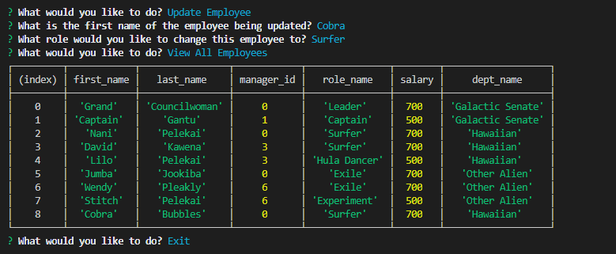

# EmployeeTracker

## Overview
Database management that allows you to view, add, and update employee informatoin

## Table of Contents
* [Preview](#Preview)
* [Links](#Links)
* [Objectives](#Objectives)
* [Installation](#Installation)
* [Credit](#Credit)

## Preview

 
 

## Objectives
Using MySQL and Javascript, interact and work with the database to do the following:

* View all Employees, Departments, and Roles
* Add new Departments, Employees, and Roles
* Update Employee Role information

## Systems Used
* Javascript
* MySQL

## Installation
To install for yourself, type   
    `npm i`   
and then run using node. 

## Credit 
All code written by me